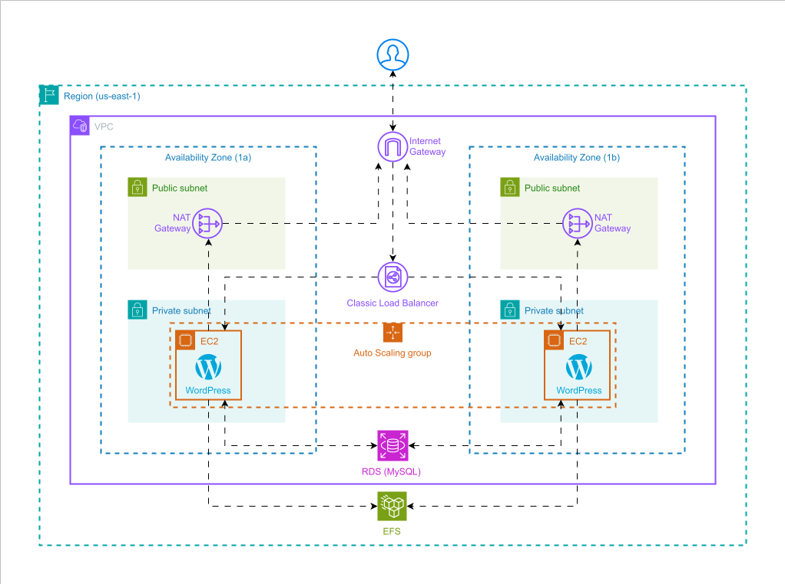

<h3 align="center">< Projeto DemoDay /></h3>

  	 
    
    <h1>DevOps</h1>

Documentação do projeto **DemoDay**.

### Contexto

Uma empresa cujo foco principal é a **criação e publicação de conteúdos** em blogs (baseado em WordPress) enfrentou um **crescimento expressivo** na quantidade de leitores e usuários acessando a plataforma.

Com o aumento do tráfego e da demanda por novos conteúdos, surgiu a necessidade de uma **infraestrutura** mais **robusta**, **escalável** e **automatizada**.

### Objetivo

A equipe precisa provisionar uma **infraestrutura** moderna na nuvem para hospedar seu sistema de publicação de conteúdos. A proposta é construir essa estrutura na **AWS**, garantindo **escalabilidade** e **automação**. Os principais requisitos incluem:

- Instalar e configurar o Docker em uma EC2 (usando User Data);
- Configurar **Wordpress** com **Docker** compose;
- Utilizar o **RDS** _(mysql)_;
- Utilizar o **EFS**;
- Utilizar o **Application Load Balancer**;
- Utilizar o **NAT Gateway**;
- Utilizar o **Internet Gateway**;
- Utilizar o **Auto Scaling Group**;

O objetivo é fazer tudo isso de forma **automatizada** e **reutilizável** usando **Terraform**, garantindo que qualquer pessoa da equipe possa subir a mesma infra com um único comando.

### Diagrama da solução

|                                                       -                                                        | **Serviço**        |
| :------------------------------------------------------------------------------------------------------------: | ------------------ |
|                                         | EC2                |
|                            | Auto Scaling Group |
|   | VPC                |
|  | ALB                |
|   | VPC                |
|                                         | EFS                |
|                         | EBS                |
|                                        | RDS (MySQL)        |
