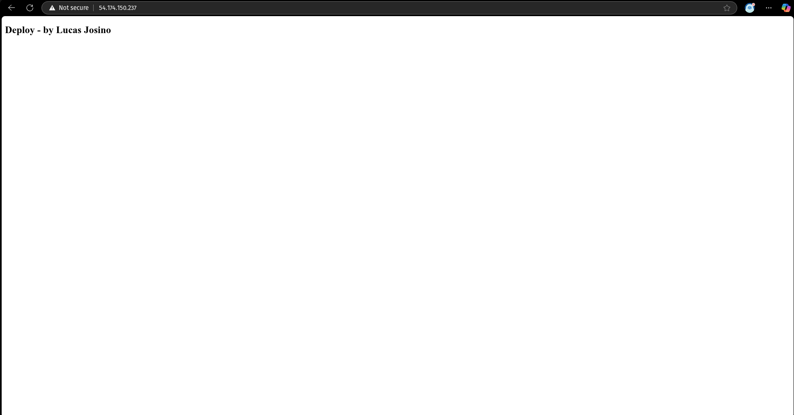

<h3 align="center">< Projeto AWS + Container + Nginx /></h3>

<div align="center">
  	<br>
    
    <h1>DevOps</h1>
</div>

Documentação do projeto de DevOps com **AWS**, **Container** e **Nginx**.

> Todo o passo a passo foi feito em Linux (_PopOs 22.04_)

### Preparando o ambiente

Preparando o ambiente envolve a criação da chave do GHCR (GitHub Container Registry) e adicionando aos segredos do repositório, o build do container vai ocorrer por meio de CI/CD (GitHub Actions). [Veja o workflow](../.github/workflows/aws-container-nginx.yaml)

Acesse: https://github.com/settings/tokens/new?scopes=write:packages

- Selecione o escopo **read:packages** para **baixar imagens de contêiner** e **ler seus metadados**.
- Selecione o escopo **write:packages** para **baixar e enviar imagens de contêiner**, além de **ler e escrever seus metadados**.
- Selecione o escopo **delete:packages** para **excluir imagens de contêiner**.

#### Como adicionar um segredo (secret) em um repositório do GitHub

1. Acesse o repositório no GitHub.
2. Clique na aba **"Settings"** (Configurações) do repositório.
3. No menu lateral esquerdo, vá até **"Secrets and variables" > "Actions"**.
4. Clique no botão **"New repository secret"**.
5. Preencha os campos:

   - **Name**: o nome do segredo (exemplo: `GHCR_TOKEN`)
   - **Secret**: o valor do segredo (exemplo: seu token de acesso pessoal)

6. Clique em **"Add secret"** para salvar.

### Preparando o container

Preparando o container envolve a criação do arquivo `index.html` e `Dockerfile`:

#### Criando o index.html

Arquivo base para user utilizando com o Nginx:

```html
<!DOCTYPE html>
<html lang="en">
  <head>
    <meta charset="utf-8" />
    <title>Docker Nginx</title>
  </head>

  <body>
    <h2>Deploy - by <strong>Lucas Josino</strong></h2>
  </body>
</html>
```

#### Criando o Dockerfile

Instruções para o build do container:

```Dockerfile
FROM nginx:latest

COPY ./index.html /usr/share/nginx/html/index.html
```

### Configurando o Terraform

A configuração envolve os **Security Groups**, **EC2**, **VPC** _(Subnet, Route Table e Internet Gateway)_:

- [main.tf](./aws-container-nginx-projeto/main.tf)
- [ec2.tf](./aws-container-nginx-projeto/ec2.tf)
- [security-groups.tf](./aws-container-nginx-projeto/security-groups.tf)
- [vpc.tf](./aws-container-nginx-projeto/vpc.tf)

> [!WARNING]
>
> - É necessário configurar o `terraform.tfvars` baseado no [terraform.tfvars.example](./aws-container-nginx-projeto/terraform.tfvars.example)
> - Essa configuração utiliza o `--profile`

### Rodando o CI/CD de forma manual

1. Vá até o repositório no GitHub.
2. Clique na aba "Actions".
3. Selecione o workflow que você criou/alterou na lista à esquerda.
4. Clique no botão "Run workflow" (Executar workflow).
5. Se desejar, preencha os inputs (se houver).
6. Clique em "Run workflow" para iniciar manualmente.

### Rodando o Terraform

Iniciei o terraform com os seguintes comandos:

```sh
terraform init
terraform plan
terraform apply
```

### Conclusão

Após todo esse processo, a partir do ip do terminal (_outputs.tf_), consegui acessar o site:



### Referências

- https://docs.github.com/en/packages/working-with-a-github-packages-registry/working-with-the-container-registry
