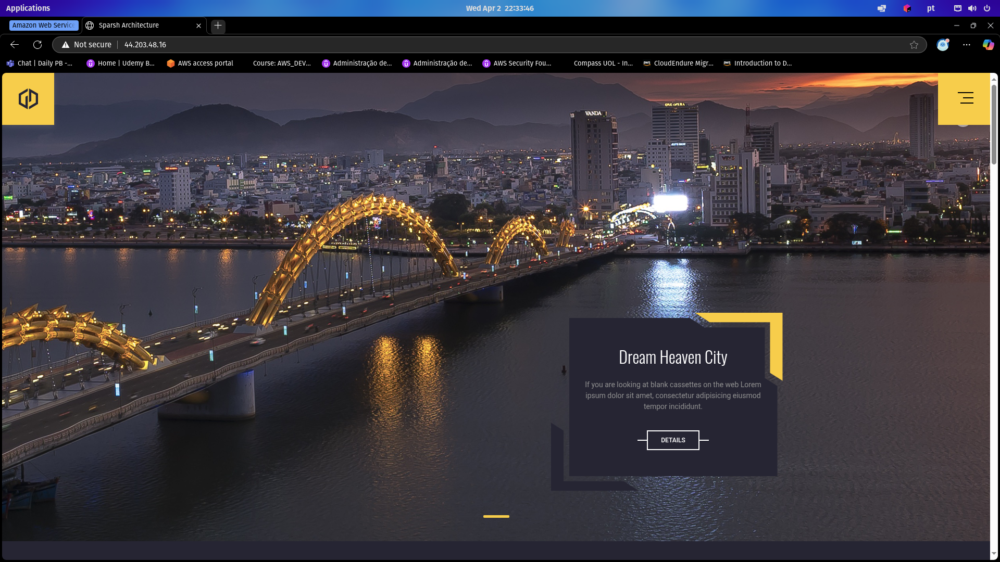

<h3 align="center">< Projeto Terraform + AWS /></h3>

<div align="center">
  	<br>
    
    <h1>DevOps</h1>
</div>

Documentação do projeto de DevOps com **Terraform** e **AWS**.

> Todo o passo a passo foi feito em Linux (_PopOs 22.04_)

### Instalando Terraform

Instalei o Terraform utilizando **apt**, com o seguinte comando:

```sh
wget -O - https://apt.releases.hashicorp.com/gpg | sudo gpg --dearmor -o /usr/share/keyrings/hashicorp-archive-keyring.gpg
echo "deb [arch=$(dpkg --print-architecture) signed-by=/usr/share/keyrings/hashicorp-archive-keyring.gpg] https://apt.releases.hashicorp.com $(lsb_release -cs) main" | sudo tee /etc/apt/sources.list.d/hashicorp.list
sudo apt update && sudo apt install terraform
```

- https://developer.hashicorp.com/terraform/install#linux

### Instalando AWS CLI

Instalei o AWS CLI com o seguinte comando:

```sh
curl "https://awscli.amazonaws.com/awscli-exe-linux-x86_64.zip" -o "awscli-exe-linux-x86_64.zip"
unzip -q awscli-exe-linux-x86_64.zip
sudo ./aws/install
rm -rf aws awscli-exe-linux-x86_64.zip
```

Verificando:

```sh
aws --version
```

- https://docs.aws.amazon.com/cli/latest/userguide/getting-started-install.html#getting-started-install-instructions

### Configurando o Terraform

A configuração envolve os **Security Groups**, **EC2**, **VPC** _(Subnet, Route Table e Internet Gateway)_:

- [main.tf](./aws-terraform-projeto/main.tf)
- [ec2.tf](./aws-terraform-projeto/ec2.tf)
- [security-groups.tf](./aws-terraform-projeto/security-groups.tf)
- [vpc.tf](./aws-terraform-projeto/vpc.tf)

> [!WARNING]
>
> - É necessário configurar o `terraform.tfvars` baseado no [terraform.tfvars.example](./aws-terraform-projeto/terraform.tfvars.example)
> - Essa configuração utiliza o `--profile`

### Rodando o Terraform

Iniciei o terraform com os seguintes comandos:

```sh
terraform init
terraform plan
terraform apply
```

### Conclusão

Após todo esse processo, a partir do ip do terminal (_outputs.tf_), consegui acessar o site:


