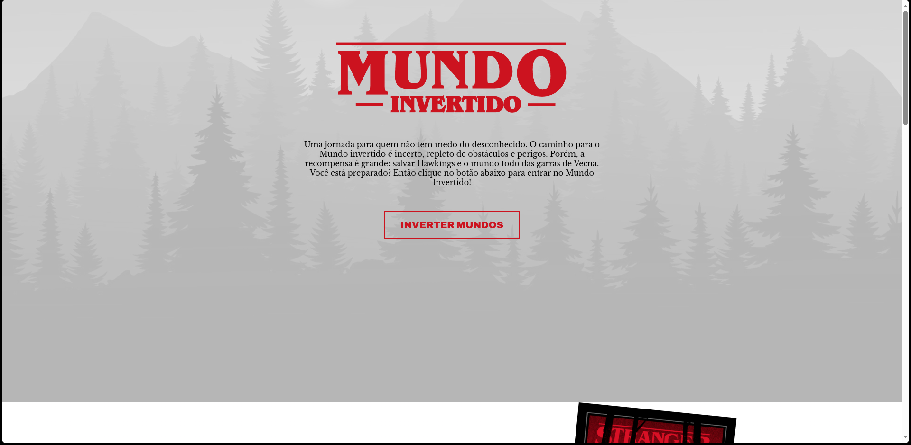

<h3 align="center">< Projeto Vagrant + Virtualbox /></h3>

<div align="center">
  	<br>
    
    <h1>DevOps</h1>
</div>

Documentação do projeto de DevOps com **Vagrant** e **VirtualBox**.

> Todo o passo a passo foi feito em Linux (_PopOs 22.04_)

### Tópicos

- Instalando VirtualBox
- Instalando Vagrant
- Configurando o Vagrantfile

### Instalando VirtualBox

Instalei o VirtualBox utilizando **apt**, com o seguinte comando:

```sh
sudo apt install virtualbox
```

### Instalando Vagrant

Instalei o Vagrant utilizando **apt**, com o seguinte comando:

```sh
sudo apt install vagrant
```

### Configurando o Vagrantfile

Gerei o arquivo base do Vagrant utilizando o comando:

```sh
vagrant init
```

Após isso, configurei da seguinte forma:

```rb
# -*- mode: ruby -*-
# vi: set ft=ruby :

Vagrant.configure("2") do |config|
  config.vm.box = "ubuntu/focal64"
  config.vm.network "public_network"
  config.vm.provider "virtualbox" do |vb|
    vb.memory = "1024"
    vb.cpus = "1"
    vb.name = "Ubuntu - Web Server 2"
  end

  config.vm.provision "shell", inline: <<-SHELL
    cd /
    apt-get update && apt-get upgrade -y
    apt-get install -y apache2 unzip
    systemctl start apache2
    systemctl enable apache2
    sudo curl -sL https://github.com/luizcarlos16/mundo-invertido/archive/refs/heads/main.zip -o /tmp/mundo-invertido.zip
    sudo unzip /tmp/mundo-invertido.zip -d /tmp
    sudo mv /tmp/mundo-invertido-main/* /var/www/html/
    sudo rm -rf /var/www/html/mundo-invertido-main
  SHELL
  Vagrant.configure("2") do |config|
    config.vm.box = "hashicorp/bionic64"
  end
end
```

Foi utilizando o script (shell) para:

- Atualizar o sistema
- Baixar o Apache
- Configurar o Apache
- Baixar o site "mundo-invertido"
- Mover os arquivos para "/var/www/html/"

### Conclusão

Após todo esse processo, a partir do ip local (**192.168.X.X**), consegui acessar o site:


